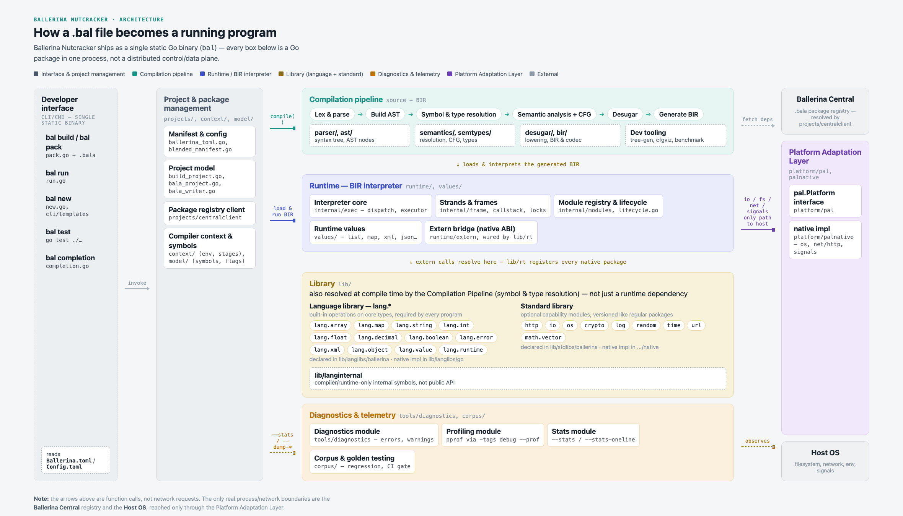

<div align="center">

<h1 style="font-size: 3.5em;">Ballerina Nutcracker</h1>

**A native Ballerina interpreter written in Go, compiling to and executing Ballerina Intermediate Representation (BIR).**

</div>

[](https://github.com/ballerina-nutcracker/ballerina/releases)
[](https://github.com/ballerina-nutcracker/ballerina/actions/workflows/native-ci.yml)
[](https://github.com/ballerina-nutcracker/ballerina/actions/workflows/golangci-lint.yml)
[](https://codecov.io/gh/ballerina-nutcracker/ballerina)
[](https://opensource.org/licenses/Apache-2.0)
[](CODE_OF_CONDUCT.md)
[](https://discord.gg/ballerinalang)
[](https://stackoverflow.com/questions/tagged/ballerina)


[](https://play.ballerina.io/)
Run and share Ballerina snippets in your browser — no installation needed.

## Table of contents

- [What is Ballerina?](#what-is-ballerina)
- [What is Ballerina Nutcracker?](#what-is-ballerina-nutcracker)
- [Architecture](#architecture)
- [Getting started](#getting-started)
- [Developer guide](#developer-guide)
- [Scope & roadmap](#scope--roadmap)
- [Report issues](#report-issues)
- [Contribute](#contribute-to-ballerina-nutcracker)
- [License](#license)
- [Join the community](#join-the-community)

## What is Ballerina?

[Ballerina](https://ballerina.io) is an open-source, cloud-native programming language optimized for integration. It has built-in support for JSON and XML, first-class constructs for services and concurrency, and structural typing. It is developed and supported by [WSO2](https://wso2.com) and the wider Ballerina community.

## What is Ballerina Nutcracker?

**Ballerina Nutcracker** is a native Ballerina interpreter written in Go. It compiles Ballerina source to **Ballerina Intermediate Representation (BIR)** and interprets the BIR directly, with a focus on speed, low memory use, and fast startup — properties suited to short-lived, cloud-native workloads (CLIs, functions, sidecars) where JVM warm-up cost is undesirable.

Development is organized by **subsets** of the Ballerina language; each milestone adds support for a defined subset. See [Scope & roadmap](#scope--roadmap) for current coverage.

## Architecture

A `.bal` program passes through a compilation pipeline (source → BIR) and is then executed by the BIR interpreter; both stages draw on the language and standard library:

<picture>
  <source media="(prefers-color-scheme: dark)" srcset="doc/img/architecture-dark.png">
  
</picture>

Source directories map to these components as: [`parser/`](parser/) (lexing/parsing) → [`ast/`](ast/) → [`semantics/`](semantics/) (symbol/type resolution, semantic analysis, CFG) → [`semtypes/`](semtypes/) (structural type system) → [`desugar/`](desugar/) → [`bir/`](bir/) (BIR model, generation, codec) → [`runtime/`](runtime/) and [`values/`](values/) (the BIR interpreter and its runtime value representations). The **Library** is split into the [`lib/langlibs/`](lib/langlibs/) language library (`lang.array`, `lang.map`, `lang.string`, …, required by every program) and the [`lib/stdlibs/`](lib/stdlibs/) standard library (`http`, `io`, `os`, `crypto`, …, optional capability modules); both are declared in Ballerina and backed by native Go implementations wired together by [`lib/rt`](lib/rt). Cross-cutting packages: [`projects/`](projects/) (manifest/package resolution), [`model/`](model/) (symbols, package/flag metadata), [`context/`](context/) (compiler context/environment shared across stages), and [`platform/pal/`](platform/pal/) (the Platform Adaptation Layer — all I/O, filesystem, and network access is routed through here rather than calling the OS/Go stdlib directly).

Unlike a distributed platform with separate control/data/observability planes, every component in the diagram is a Go package compiled into the single `bal` binary — the arrows are function calls, not network requests. The only real process/network boundaries are the Ballerina Central registry (package downloads) and the host OS (reached exclusively through the Platform Adaptation Layer).

See [AGENTS.md](AGENTS.md) for the exact stage list and the concurrency/error-handling rules between stages.

## Getting started

### Prerequisites

The project is built using the [Go programming language](https://go.dev/). The following dependencies are required:

- [Go 1.26 or later](https://go.dev/dl/)

### Build the CLI

#### Production build (default)

```bash
go build -o bal ./cli/cmd
```

#### Debug build

Enables profiling and more detailed type-error diagnostics.

```bash
go build -tags debug -o bal-debug ./cli/cmd
```

### Using the CLI

```bash
./bal --help
./bal run --help
```

#### Running a `.bal` source

Currently, the following are supported:

- Single `.bal` file
- Ballerina package with only the default module

E.g.

```bash
./bal run --dump-bir corpus/bal/subset1/01-boolean/equal1-v.bal
./bal run projects/testdata/myproject
```

### Running tests

```bash
go test ./...
```

## Developer guide

### Debugging

`bal run` and `bal pack` accept flags to inspect any stage of the compilation pipeline:

| Flag | Purpose |
| --- | --- |
| `--dump-tokens` | Dump lexer tokens |
| `--dump-st` | Dump the syntax tree |
| `--dump-ast` | Dump the abstract syntax tree |
| `--dump-cfg` | Dump the control flow graph |
| `--dump-bir` | Dump the generated BIR |
| `--format dot` | Render `--dump-cfg`/`--dump-bir` output as Graphviz `.dot` |
| `--trace-recovery` | Trace parser error recovery |
| `--stats` / `--stats-oneline` | Print per-stage compilation timing |
| `--log-file <path>` | Write debug output to a file instead of stdout |

E.g., visualize a CFG:

```bash
./bal run --dump-cfg --format dot corpus/bal/subset1/01-boolean/equal1-v.bal | dot -Tpng -o cfg.png
```

Debug builds (`-tags debug`) also unlock more detailed type-check error messages — useful when narrowing down semantic analysis issues.

### Profiling

Profiling is only available in debug builds (compiled with `-tags debug`).

#### Enable profiling

```bash
# Default profiling port (:6060)
./bal-debug run --prof corpus/bal/subset1/01-boolean/equal1-v.bal

# Custom port
./bal-debug run --prof --prof-addr=:8080 corpus/bal/subset1/01-boolean/equal1-v.bal

# Write profiles directly to a file instead of serving them
./bal-debug run --cpuprofile=cpu.prof --memprofile=mem.prof corpus/bal/subset1/01-boolean/equal1-v.bal
```

#### Access profiling data

- Web UI: http://localhost:6060/debug/pprof/
- CPU Profile: http://localhost:6060/debug/pprof/profile?seconds=30
- Heap Profile: http://localhost:6060/debug/pprof/heap
- Goroutines: http://localhost:6060/debug/pprof/goroutine

#### Analyze with pprof tool

```bash
# CPU profiling (30 second sample)
go tool pprof http://localhost:6060/debug/pprof/profile?seconds=30

# Heap profiling
go tool pprof http://localhost:6060/debug/pprof/heap

# Interactive web UI
go tool pprof -http=:8081 http://localhost:6060/debug/pprof/profile?seconds=30
```

### Testing

```bash
go test ./...
```

Most interpreter behavior is validated with **corpus tests** rather than hand-written unit tests: `.bal` fixtures under [`corpus/bal/`](corpus/bal/) are compiled/interpreted end to end and checked against golden output (valid `-v.bal`), expected error markers (`-e.bal`), or expected panics (`-p.bal`). Each corpus test accepts an `-update` flag to refresh its golden/expected output. See [AGENTS.md](AGENTS.md#tests) for the full layout and conventions, and prefer adding a corpus test over a unit test when validating interpreter behavior.

Code coverage is tracked via [Codecov](https://codecov.io/gh/ballerina-nutcracker/ballerina); PRs are expected to keep patch coverage at or above the target configured in [`codecov.yml`](codecov.yml).

## Scope & roadmap

Development is organized by **subsets** of the Ballerina language; each milestone adds support for a defined subset.

- **Progress:** [GitHub Milestones](https://github.com/ballerina-nutcracker/ballerina/milestones)
- **Subset docs:** [doc/](doc/) (language and standard library features and restrictions per subset)
- **Language spec:** [ballerina-platform/ballerina-spec](https://github.com/ballerina-platform/ballerina-spec)

## Report issues

> **Tip:** If you are unsure whether you have found a bug, search the [existing issues](https://github.com/ballerina-nutcracker/ballerina/issues) in the GitHub repo and open an issue if needed.

### Open an issue

- [Open an issue](https://github.com/ballerina-nutcracker/ballerina/issues) for bug reports or feature requests related to Ballerina Nutcracker.

### Report security issues

- Send an email to [security@ballerina.io](mailto:security@ballerina.io). For details, see the [security policy](SECURITY.md).

## Contribute to Ballerina Nutcracker

As an open-source project, this repository welcomes contributions from the community. To start contributing, read the [contribution guidelines](CONTRIBUTING.md).

## License

This project is distributed under [Apache License 2.0](./LICENSE).

## Join the community

- Get help on [Stack Overflow](https://stackoverflow.com/questions/tagged/ballerina)
- Join the conversations in the [Discord community](https://discord.gg/ballerinalang)
- For more details on how to engage with the community, see [Community](https://ballerina.io/community/)
